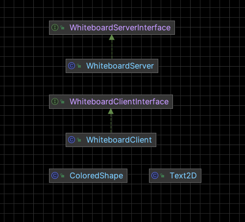

# Distributed Shared Whiteboard

## Introduction

This repo is an implementation of the assignment 2 for the course COMP90015: Distributed Systems. The details can find in the 
[Assignment 2](Project2-Sem1-2023.pdf).

---

This projects consists of a simple real-time white board which allows multiple users to draw on the same canvas. The whiteboard is implemented using Java and SwingUI.
Remote Method Invocation (RMI) is adopted to keep the real-time, efficient, and reliable communication between multiple JVMs.


## GUI Design


## Language and Tools
<div style="display: flex; flex-direction: row; gap: 10px;">
    
    
    
    
    
    
</div>


[//]: # (## Folder Instructions)

[//]: # ()
[//]: # ()


## How to compile and Run

### Compile
1. Compile the server and client files using the following command:
```shell
cd src

javac WhiteboardClient.java
javac WhiteboardServer.java
```

2. Run the server with the following command:

   (the command should follow the format: java WhiteboardServer <host> <port> <username>)
```shell
java WhiteboardServer localhost 1099 Tom
```

3. Run the client with the following command:

   (the command should follow the format: java WhiteboardClient <host> <port> <username>)

    Note: The client should get the same `host` and `port` with the server.
```shell
java WhiteboardClient localhost 1099 Jerry
```

### Or

We also provide `Jar` file, you can run the server and client with the following command:

Note: The client should get the same `host` and `port` with the server.

For the server:
```shell [server]
java -jar CreateWhiteBoard.jar localhost 1099 Tom
```

For the client:
```shell [client]
java -jar JoinWhiteBoard.jar localhost 1099 Tom
```


## Interaction Diagram


## Report
You can check the report in the [Report.pdf](DS_A2_report.pdf)


## License
This project is open-source and free to use under the [MIT License](LICENSE).